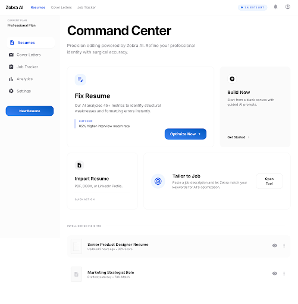
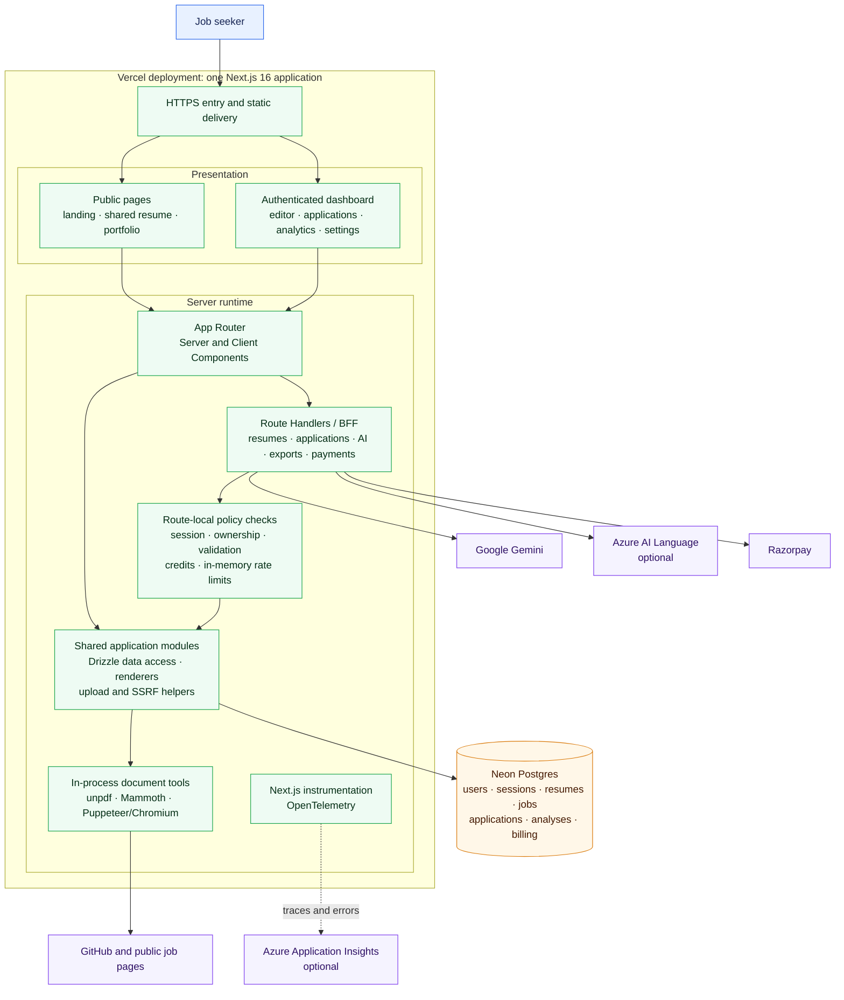
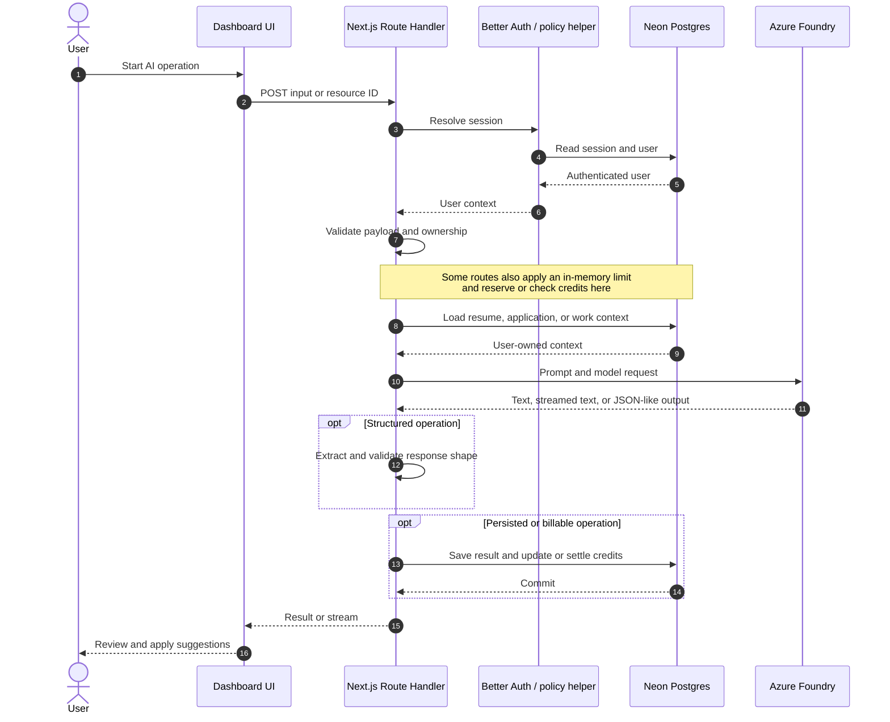
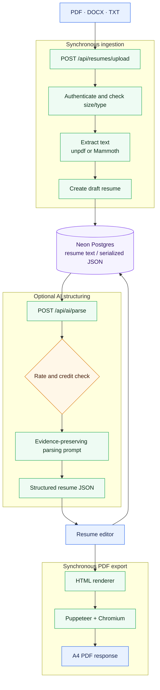
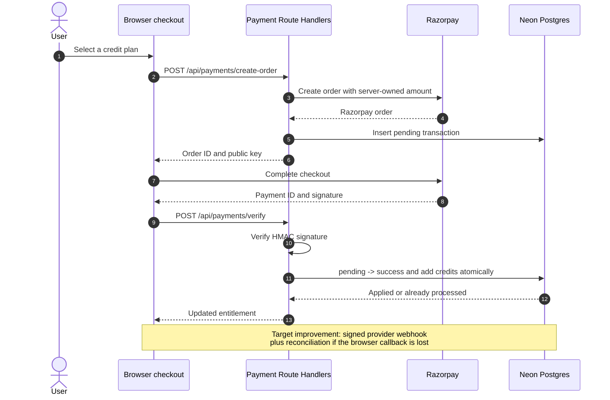
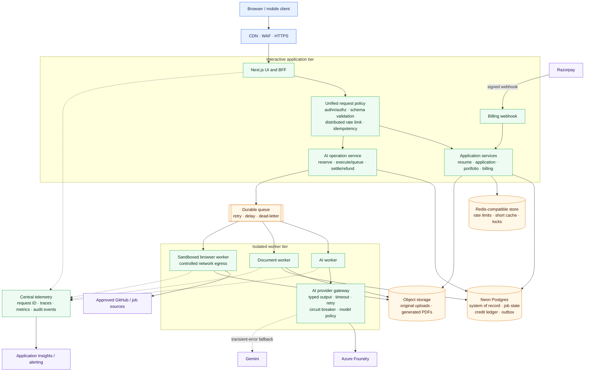

# Zebra AI

Zebra AI is a full-stack resume and job-application workspace. It combines a structured resume editor, ATS analysis, job-specific tailoring, cover letters, application tracking, portfolio publishing, and PDF export in one product.



## Product capabilities

- Build, import, version, duplicate, and share resumes.
- Analyse resumes and tailor them to a job description with Azure Foundry, with Gemini available only as a transient-error fallback.
- Track applications, proposed resume changes, work evidence, and certifications.
- Generate cover letters and publish a lightweight portfolio.
- Import PDF, DOCX, and TXT resumes and export resumes or cover letters as PDF.
- Purchase usage credits through Razorpay.
- Capture server telemetry through OpenTelemetry and Azure Application Insights when configured.

## Technology stack

| Layer | Technology |
| --- | --- |
| Web application | Next.js 16 App Router, React 19, TypeScript |
| UI | Tailwind CSS 4, Framer Motion, React Icons |
| API / BFF | Next.js Route Handlers |
| Authentication | Better Auth with email/password and optional Google OAuth |
| Database | Neon Postgres, Drizzle ORM |
| Generative AI | Azure Foundry Responses API with Gemini fallback |
| Language analysis | Azure AI Language, optional |
| Document processing | `unpdf`, Mammoth, Puppeteer, serverless Chromium |
| Payments | Razorpay |
| Observability | OpenTelemetry, optional Azure Application Insights |
| Hosting | Vercel-compatible Node.js runtime |

## Architecture

Zebra currently ships as a **modular monolith**: the UI, server-rendered pages, API boundary, AI orchestration, document processing, and billing integration are deployed together as one Next.js application. This is a sensible shape for the current product stage, but long-running and distributed concerns need stronger boundaries before high-scale production use.

The diagrams below deliberately label the current implementation and the recommended target separately. Redis, a durable queue, object storage, dedicated workers, and a payment webhook are **target-state components**; they are not present in the current runtime.

### Current system architecture



### Authenticated AI operation — current flow

This is the common shape of an analyse, tailor, parse, audit, chat, or copilot request. The exact rate-limit and credit behavior currently differs by endpoint.



### Resume ingestion and export — current flow

Uploaded files are processed synchronously. Extracted text is stored in `resumes.content`; the original file is not retained in object storage.



### Payment and credit grant — current flow

The current implementation verifies the Razorpay checkout signature and uses a conditional transaction update to avoid granting credits twice. Finalization is initiated by the browser; there is no independent Razorpay webhook route yet.



### Recommended production target

Keep the modular monolith for interactive reads and writes, but move slow, untrusted, or retryable work behind durable boundaries.



## Architecture gaps and improvement roadmap

| Priority | Gap found in the current repository | Recommended improvement | Why it matters |
| --- | --- | --- | --- |
| P0 | `src/lib/rate-limit.ts` stores counters in an in-memory `Map`, so limits reset and are not shared across serverless instances. Expensive routes now require a session, validate bounded input, and apply the local limiter, but enforcement is still instance-local. | Replace the local implementation with a Redis-compatible sliding-window limiter behind the existing route boundaries. | Prevents limits from being bypassed across instances and deployments. |
| P0 | URL analyzers resolve DNS, reject non-public destinations, revalidate the final redirect, and block unsafe subrequests, but Chromium still runs with `--no-sandbox` in the web runtime on serverless hosts. | Move browsing to a sandboxed worker with controlled egress, DNS pinning, and strict CPU, memory, and time limits. | Reduces browser-exploit, DNS-rebinding, and noisy-neighbor risk. |
| P0 | Payment credits are finalized by `/api/payments/verify` after the browser returns from checkout; no Razorpay webhook handler or reconciliation worker exists. | Treat signed Razorpay webhooks as the source of truth. Store provider event IDs, process them idempotently, model explicit transaction states, and reconcile stale pending orders. | A closed tab or network failure should not leave a paid customer without credits. |
| P1 | AI calls, PDF generation, URL scraping, and file parsing run synchronously inside Route Handlers. | Introduce a durable job table and queue with separate AI, document, and browser workers. Return `202 Accepted` with a job ID and expose progress through polling or server-sent events. | Avoids request timeouts and supports retries, cancellation, backpressure, and dead-letter handling. |
| P1 | AI routes now use the Azure-first provider gateway with bounded task budgets; several routes also validate structured output and reserve/refund credits atomically. Prompt versioning, a shared operation service, and an immutable credit ledger are still missing. | Add prompt versions, idempotency keys, typed provider output, and an `AiOperationService` backed by an immutable credit ledger. | Makes retries, audits, model changes, and cost reporting consistent. |
| P1 | The `ai_usage` table is defined but not written by the application. | Record operation, model, prompt version, token counts, latency, credit cost, idempotency key, result status, and trace ID for every AI attempt. | Enables cost attribution, abuse detection, quality analysis, and safe retries. |
| P1 | `resumes.content` can contain raw text or serialized JSON, while uploaded originals and generated PDFs are not durably stored. Upload validation is also split between route-local checks and an unused shared helper with different limits. | Define one versioned resume document schema. Store originals and generated artifacts in private object storage; keep metadata, hashes, ownership, retention status, and object keys in Postgres. Centralize magic-byte, MIME, extension, and size validation. | Removes ambiguous data contracts and enables reprocessing, malware scanning, retention, and reliable export. |
| P1 | Much of the orchestration and persistence logic lives directly in route files. | Keep Route Handlers thin and move behavior into application services, repositories, provider adapters, and explicit transaction boundaries organized by feature. | Improves testability and prevents rules from drifting between endpoints. |
| P2 | Instrumentation captures server errors and optional Azure traces, but most routes use free-form console logs without a request or operation correlation ID. | Add structured redacted logs, request IDs, spans around DB/provider calls, latency and failure metrics, queue-depth alerts, payment alerts, and AI cost dashboards. | Makes multi-step incidents diagnosable and provides service-level evidence. |
| P2 | The repository now has one canonical schema, reviewed forward-only migrations, migration-integrity tests, and a CI workflow. Applying migrations is still a manual release step and does not yet include automated staging rollback drills. | Run every migration in staging before production and adopt an expand/backfill/contract rollout for breaking changes. | Reduces schema drift and deployment risk. |

### Recommended implementation order

1. Establish the unified API policy, distributed rate limiting, webhook-based billing, and browser isolation.
2. Add durable jobs and worker boundaries for AI, parsing, scraping, and PDF generation.
3. Consolidate AI operations and credit accounting around an idempotent ledger.
4. Introduce object storage and a versioned resume-document contract.
5. Complete correlated observability, migration automation, and service-level dashboards.

## Repository structure

```text
src/
├── app/                 # App Router pages, layouts, and Route Handlers
├── components/          # Product and UI components
├── context/             # Client settings context
├── hooks/               # Client hooks
├── lib/                 # Auth, data, policy, AI-adjacent, rendering, and safety helpers
├── styles/              # Compiler-specific styles
└── instrumentation.ts   # OpenTelemetry / Application Insights bootstrap
drizzle/                 # SQL migrations
scripts/                 # Operational scripts
tests/                   # Unit, integration, safety, and browser-journey tests
```

## Getting started

### Prerequisites

- Node.js 22 or newer
- A Neon Postgres database
- An Azure Foundry API key for the primary AI provider
- An optional Gemini API key for transient-error fallback
- Optional Google OAuth, Razorpay, Azure AI Language, and Application Insights credentials

### Installation

1. Clone and install dependencies.

   ```bash
   git clone https://github.com/Bishu-21/zebra-ai.git
   cd zebra-ai
   npm install
   ```

2. Create `.env.local`.

   ```env
   DATABASE_URL=postgresql://...

   BETTER_AUTH_SECRET=replace-with-a-long-random-secret
   BETTER_AUTH_URL=http://localhost:3000
   NEXT_PUBLIC_APP_URL=http://localhost:3000

   # Primary AI provider. Keep the key server-only.
   AZURE_FOUNDRY_API_KEY=...
   AZURE_FOUNDRY_OPENAI_BASE_URL=https://zebra-ai-uae-resource.services.ai.azure.com/openai/v1/
   AZURE_FOUNDRY_PROJECT_ENDPOINT=https://zebra-ai-uae-resource.services.ai.azure.com/api/projects/zebra-ai-uae
   AZURE_FOUNDRY_DEPLOYMENT=zebra-gpt-5-4-mini

   # Optional transient-error fallback
   GEMINI_API_KEY=...
   GEMINI_MODEL=gemini-3.1-flash-lite

   # Optional Google OAuth
   GOOGLE_CLIENT_ID=...
   GOOGLE_CLIENT_SECRET=...

   # Optional paid credits
   NEXT_PUBLIC_RAZORPAY_KEY_ID=...
   RAZORPAY_KEY_SECRET=...

   # Optional Azure integrations
   AZURE_LANGUAGE_ENDPOINT=...
   AZURE_LANGUAGE_KEY=...
   APPLICATIONINSIGHTS_CONNECTION_STRING=...
   ```

3. Apply the development schema and start the app.

   ```bash
   npm run db:migrate
   npm run dev
   ```

Open [http://localhost:3000](http://localhost:3000).

After adding the Azure API key, verify the deployment without starting the web app:

```bash
npm run azure:smoke
```

For a project-scoped base URL, copy **API Key** from **Manage → Project
details** for that exact project. For a resource-scoped base URL, use **KEY 1**
or **KEY 2** from the resource's **Keys and Endpoint** page. A key copied from
a different Foundry project or Azure AI resource will return HTTP 401 even
when the deployment name is correct.

Do not run `drizzle-kit push --force` automatically against production. See [DEPLOYMENT.md](DEPLOYMENT.md) for the current deployment procedure.

## Quality checks

```bash
npm run lint
npm run typecheck
npm run test
npm run build
```

Run the complete verification chain with:

```bash
npm run check
```

## License

MIT
