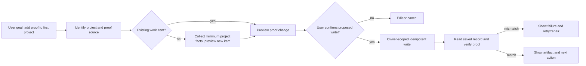

# Zebu action harness: founder alpha plan

**Status:** Proposed implementation blueprint, 2026-09-23. This document plans work; it does not claim the workflows exist.
**Goal:** Let Zebu complete useful Zebra tasks with user control, source grounding, truthful progress, and recoverable failures.
**First acceptance journey:** From the empty Portfolio screen, help Bishal create a real work item and attach a proof URL or file, then show the saved item and its verified proof. Ask for missing facts only once.

## What the screenshots reveal

The user asked Zebu to add proof to a first work item. The portfolio had zero work items. Zebu said the user had to select an existing item, then claimed to open Portfolio while already there. The UI eventually reported “Portfolio is open,” which was technically true but did not advance the requested job. This is a **goal-completion failure**, not merely a navigation failure.

Current code supports that diagnosis: `src/lib/zebu-contract.ts` models one action per text turn; `src/lib/zebu-live-prompt.ts` explicitly disables direct record mutations; `src/lib/zebu-actions.ts` exposes navigation/search/open tools to the live model but not its existing draft creation helpers. `src/app/api/work/route.ts` can create a work item with `proofUrl`, subject to authenticated ownership and validation. The missing part is an authorized, verified workflow connecting these pieces. This plan extends `docs/zebra-trusted-workspace-blueprint-2026-09-23.md` rather than replacing it.

## Reverse trace from the desired outcome

The reverse trace exposes four gaps: no entity resolution when the item does not exist; no structured proposal/confirmation boundary; no durable execution state; and no read-after-write receipt. Better wording or a trained model cannot supply missing tools or permissions.

## Approach choice

| Approach | Benefit | Limit |
| --- | --- | --- |
| More prompts and shortcuts | Fast for a few phrases | Brittle; cannot guarantee actual writes or verification |
| Model with broad CRUD tools | Flexible | Unsafe without ownership, approval, idempotency, and audit controls |
| **Typed action harness with bounded planner** | Reusable and inspectable; can finish multi-step jobs | Requires workflow state and careful UI integration |

Choose the typed harness. Keep existing deterministic commands as fast paths. The model proposes an intent or next step; server-side policy decides which capabilities are available. The UI displays every consequential proposed change before execution.

## Harness contract

1. **Intent and context:** Normalize typed or spoken request into `goal`, `targetEntity`, `sourceReferences`, and `constraints`. Use the current route and selected entity as hints, never as proof that an item exists. Resolve ambiguous names through owner-scoped search; show choices.
2. **Plan graph:** A coordinator creates a small directed acyclic graph of typed steps. Each step declares required inputs, allowed capability, output schema, side-effect class, timeout, retry policy, and completion check. No free-form recursive agent loop.
3. **Capability registry:** Each tool declares `read`, `draft`, `internal_write`, or `external_write`; required scope; input schema; owner check; confirmation policy; idempotency semantics; and verifier. The model cannot call arbitrary HTTP endpoints or generate raw database queries.
4. **Execution gate:** Reads and reversible Zebra drafts can run under normal authenticated intent. Material internal changes show a precise diff and require the user's confirmation for that proposed change. External publication, messages, submissions, paid operations, and deletions require separate explicit review. A confirmation token binds user, capability, target, input hash, and expiry; it is consumed once.
5. **Source and result:** Persist source IDs and spans for claims. Tool output is evidence only after schema validation. A successful HTTP response is not completion: query the saved object and compare the expected fields. Never let model prose set the completed state.
6. **Run ledger:** Persist run/step status (`queued`, `running`, `needs_input`, `needs_approval`, `completed`, `failed`, `canceled`), actor, timestamps, input/output hashes, artifact IDs, safe error code, and idempotency key. Reconnect resumes the run. Cancellation prevents future steps; compensating actions are offered where safe, not fabricated as universal undo.
7. **UI:** In Zebu, show goal, selected sources, next question, proposed diff, progress, and final artifact in one compact panel. Use “I can add this after you confirm” before the write; “Saved and verified” only after read-after-write. If blocked, say what is missing and offer one actionable recovery path.

### First vertical slice: Portfolio proof

Input: user asks to add proof. Read owner-scoped work items. If none, ask for project title and a short factual description; offer the existing Work creation form in the same flow. Accept a user-supplied proof URL or file supported by a dedicated upload path. Validate URL scheme/host and file type/size. Preview exactly which work item and `proofUrl` or attachment will change. Confirm, write with an idempotency key, re-read by owner ID, and display the saved result. When no proof is supplied, ask for it; do not invent or search the user's unrelated tabs.

The first slice may use `proofUrl` only if file storage is not ready; the UI must describe that limit accurately. Do not silently treat a GitHub URL as proof of a specific achievement. Do not publish the item without separate review.

### Subsequent vertical slices

1. Application draft from job URL/PDF, with extracted fields reviewed once and the created application verified.
2. Open an existing resume, run analysis, present evidence-linked edits, and save an approved version.
3. LinkedIn draft from approved evidence, with each claim traceable and unsupported content held as a question. External profile changes depend on actual approved API capabilities.
4. Connector reads from selected GitHub repositories and other approved sources. Expose exact scopes, snapshot age, and disconnect controls.

## Six bounded roles

The six roles in the existing workspace blueprint remain useful as **logical workers**, not six simultaneous models: coordinator, source collector, role analyst, resume drafter, profile drafter, verifier. For the Portfolio slice, only coordinator, source collector, and verifier are needed. Each role has a versioned schema and a maximum tool budget. The harness owns control flow; a role cannot approve its own proposed write.

## Data structures and algorithms: use where they solve a measured problem

- **Graph:** Model task dependencies and provenance. Nodes represent source, extracted fact, proposal, approval, write, and artifact; edges record `derived_from`, `requires`, and `approved_by`. A topological scheduler runs independent read nodes concurrently and blocks descendants when prerequisites fail.
- **Backtracking:** On a failed or ambiguous step, return to the nearest unresolved decision with saved context. Example: invalid proof URL returns to the proof-source node, not the start of the chat. Avoid unbounded search over plans.
- **Dynamic programming:** Do not add it as an architectural ingredient by default. Consider memoization for repeated evidence-to-requirement matching keyed by source hash, target role, and rubric version; measure repeated computation before implementing it.
- **Sliding window:** Keep a bounded conversational context with a durable summary and pinned source/approval facts. Separately use sliding-window rate limits on tool calls. Never drop a pending approval, owner ID, or source reference merely to fit a token window.
- **Parallelism:** Parallelize independent reads/extractions; serialize dependent writes and their verification. Cap concurrency and wall time per run.

## SFT and LoRA decision gate

Training comes **after** the action harness and an evaluation set. SFT can improve intent classification, tool selection, concise questioning, and structured proposals. LoRA is a parameter-efficient training method for a supported base model; it is not a capability layer and cannot grant LinkedIn access, make a missing API exist, or enforce permissions. Google currently says fine-tuning is unavailable in the Gemini API/AI Studio, although available through its enterprise platform; Microsoft Foundry lists supported fine-tunable models and methods. Therefore no promise to LoRA-tune the present Gemini Live model.

Collect consented, redacted alpha traces: user goal, authorized context, expected action graph, tool arguments, tool outcomes, final receipt, and human correction. Exclude raw tokens, private documents without opt-in, and fabricated ideal answers. Version every example by capability/schema version. Split training/evaluation by **workflow and user**, not random turns from one conversation, to avoid leakage.

Start with a fixed evaluation set of at least 50 representative tasks, including empty states, ambiguous entities, missing evidence, tool failures, revocation, retries, and prompt injection in imported text. Track task completion, false completion claims, unauthorized-write attempts, source-grounding errors, median/p95 latency, and user corrections. Compare baseline prompt + harness against any SFT model. Train a LoRA adapter only if a supported model, sufficient consented examples, and a repeatable error pattern justify it. Deploy behind a feature flag with rollback; deterministic policy/verifier remains unchanged.

## Build sequence and exit gates

1. **Instrument current failures:** Add trace IDs and separate `model_proposed`, `tool_started`, `tool_succeeded`, `ui_observed`, and `artifact_verified` events. Create a replay fixture for the two Portfolio screenshots. Gate: no narration marks success without a verifier event.
2. **Typed run store and capability registry:** Add owner-scoped run/step/proposal/approval records, RLS, schema validation, idempotency, and cross-user tests. Gate: replay/retry cannot duplicate a write or read another user's run.
3. **Portfolio vertical slice:** Build item resolution, missing-fact questions, proposal card, confirmation, proof write, and read-after-write receipt. Gate: founder completes the screenshot journey from zero work items without leaving Zebu; failure paths remain recoverable.
4. **Extend to job and resume journeys:** Reuse graph/approval/receipt primitives, not a new agent framework per page. Gate: source-to-artifact journey resumes after refresh and shows provenance.
5. **Evaluation and training:** Run the fixed suite on production-like fixtures; fix harness failures first. Introduce SFT/LoRA only when the measured model errors remain and the tuned candidate improves completion without worsening safety or latency.

**Release criterion:** A signed-in browser test with Bishal's real alpha account completes the Portfolio journey, then a separate test user cannot read or change its records. All code checks and DB migrations pass. Zebu never says “done” until the saved state is independently verified. This is the point at which the harness slice is ready for broader alpha use.

## References checked 2026-09-23

- LoRA mechanism and PEFT configuration: https://huggingface.co/docs/peft/main/conceptual_guides/lora
- SFT dataset and trainer formats: https://huggingface.co/docs/trl/v0.29.0/en/sft_trainer
- Microsoft Foundry supported fine-tuning models/methods: https://learn.microsoft.com/en-us/azure/foundry/openai/how-to/fine-tuning
- Gemini API tuning availability: https://ai.google.dev/gemini-api/docs/model-tuning
