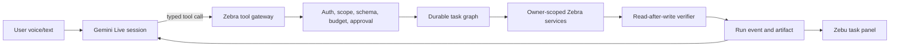

# Gemini Live harness design for Zebu

**Status:** Design proposal, 2026-09-23. No model switch or new action capability is implemented by this document.
**Purpose:** Make Gemini Live a responsive voice interface to a durable, permissioned Zebra task runner. The user should be able to say what they want, see what Zebu understood, correct it, approve consequential changes, and receive a verified artifact.

## Current baseline

`src/app/api/zebu/live-token/route.ts` issues an ephemeral Live token with audio output, transcription, a system instruction, and the tool declarations from `src/lib/zebu-actions.ts`. The default in `src/lib/zebu-live-prompt.ts` is `gemini-3.1-flash-live-preview`, overridable with `GEMINI_LIVE_MODEL`. `src/hooks/useZebuLive.ts` streams audio from the browser, receives model events, calls `/api/zebu/tool`, and sends tool responses. The session has a five-minute token lifetime. The prompt bars direct record changes, while the live tool list mostly navigates, searches, and opens UI. These controls limit harm but also cause the Portfolio failure shown by the founder: Zebu can speak about work it cannot complete.

## Design choice

Keep Gemini Live as the conversational front end. Add a server-owned run controller that executes a typed task graph. Gemini proposes goals, reads scoped context, asks for missing input, and presents proposals. The controller validates and executes tools, waits for confirmation where required, verifies resulting state, and publishes receipts. Model text never changes a run from `running` to `completed`.

### Awareness: what Zebu receives

Provide a compact, versioned `WorkspaceSnapshot`, fetched server-side on demand: current route; selected entity ID and owner-checked summary; counts and recent item names relevant to the goal; active run ID, step, pending question, and pending approval; connector capabilities; and source freshness. Send a delta when route, selection, or run state changes. Never send a whole resume collection, secrets, or a raw browser view merely to create apparent awareness. The model can call `get_workspace_snapshot` or `get_run_state` when uncertain; their results are authoritative at the time returned.

The current route is a hint. If Zebu is already on Portfolio and the user asks to add proof, it must inspect work items and begin that workflow. It must not call navigation just to report a completed action.

### Control: tool families

1. `inspect`: owner-scoped search, selected-item read, source availability, run state.
2. `propose`: create a structured action proposal with target IDs, expected fields, source references, and a human-readable diff. No mutation.
3. `execute`: only the run controller invokes a capability after policy and any required approval. A confirmation token binds user, run, action, target, input hash, and expiry. Idempotency protects retries.
4. `verify`: read the saved record; compare expected fields and source IDs; emit an outcome event. The same verifier drives the UI receipt and the tool result returned to Live.

Each declaration states when to call it, required fields, maximum lengths, and what success means. Limit one active write per run and cap total tool calls, time, and retries. Unknown tools fail closed. Imported pages, resumes, and transcripts are data, not instructions that can alter tool policy.

### Task state and autonomy

Use the task graph in `docs/zebu-action-harness-plan-2026-09-23.md`. Independent reads may run concurrently. Writes wait for required inputs and approvals, execute once, and are verified before dependent steps continue. Zebu can autonomously search the user's own saved data, build drafts, extract sources, compare evidence, and suggest next steps. It asks the user when an entity is ambiguous, evidence is missing, or a consequential write needs review. It can resume after a voice disconnect because run state lives in Zebra, not solely in Live's conversation context.

For the empty Portfolio case: inspect items → detect zero → ask for title and factual description plus proof URL/file → show a draft work item and proof preview → request confirmation → create owner-scoped record → read it back → show the saved item. If the proof is not yet supplied, preserve the draft and resume from that missing-input node.

### Attention and context strategy

Transformer attention is already part of the model; we do not add an “attention layer” to the website. We improve the information it attends to: retrieve only task-relevant records, pin the active goal and unresolved decision, attach provenance to facts, and use a bounded conversation window. Keep durable facts in the run ledger so compression cannot erase an approval or source reference. Google's Live context-window compression can reduce accumulation in long audio sessions; it is supplementary to Zebra's durable state.

Do not request or display hidden chain-of-thought. For complex work, require a concise visible plan: objective, selected source, next step, and reason for a blocking question. That gives the user control without relying on inaccessible internal reasoning.

### Live session reliability

- Evaluate `gemini-3.8-live` and `gemini-3.8-live-extended-thinking` against the currently configured model using the same voice tasks. Check availability, API version, SDK compatibility, latency, tool behavior, and cost in Zebra's account before switching. Extended thinking is a candidate for complex tasks; routine navigation and quick reads should stay responsive.
- Add Live session resumption and handle server `GoAway`; on reconnect, query Zebra's run state so any lost model context cannot duplicate work.
- Configure context-window compression and measure transcript/audio token cost. Preserve the current interruption behavior so Zebu stops speaking when the user interrupts.
- Keep ephemeral credentials short-lived and constrained. Never put the long-lived Gemini API key or connector tokens in the browser.
- Separate `tool accepted`, `tool executed`, `UI observed`, and `artifact verified` events. Speak “I’m checking” while a tool runs and “saved” only after verification.

Google documents that Gemini 3.1 Flash Live lacks asynchronous function calling, while the current 3.8 Live documentation describes non-blocking tools and an extended-thinking variant. Treat this as a compatibility test, not a reason to make unverified SDK configuration changes.

## Implementation slices

1. **Telemetry and replay:** Capture redacted Live event traces and a replay fixture for the Portfolio conversation. Define success and false-completion metrics.
2. **Snapshot and state tools:** Add `get_workspace_snapshot` and `get_run_state`, owner-scoped and bounded. Verify route/selection changes refresh context.
3. **Durable run controller:** Add task and step persistence, idempotency, event stream, and safe tool gateway. Test ownership and replay.
4. **Portfolio proof action:** Add proposal, approval, mutation, verifier, and task panel. Test from zero work items with typed and spoken input.
5. **Live reliability:** Add resumption/compression, test interruption and reconnect while a write is pending, then compare available Gemini Live model variants.
6. **Broader tasks:** Reuse the same contract for application, resume, and LinkedIn draft journeys.

**Founder acceptance:** On a signed-in browser, Bishal speaks the Portfolio request, supplies only missing facts, reviews a concrete change, and sees the saved proof. Refreshing or reconnecting resumes the same run. A second user cannot inspect or mutate it. No completion message appears before the verifier succeeds.

## Primary documentation checked 2026-09-23

- Google Live best practices: https://ai.google.dev/gemini-api/docs/live-api/best-practices
- Google Live tool use: https://ai.google.dev/gemini-api/docs/live-api/tools
- Google Live session management: https://ai.google.dev/gemini-api/docs/live-api/session-management
- Google Live extended thinking: https://ai.google.dev/gemini-api/docs/live-api/thinking
- Google ephemeral tokens: https://ai.google.dev/gemini-api/docs/live-api/ephemeral-tokens
